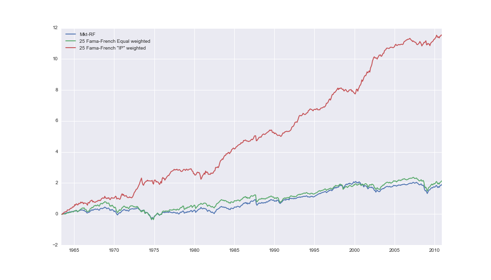

## entroport
portfolio allocation with relative entropy minimization

`python` implementation of the procedure outlined in *A One Factor Benchmark Model for Asset Pricing by Ghosh, Julliard, and Taylor (2015 working paper)*

The figure below shows the path of $1 (log scale) invested in a) the market b) an equal weight in the 25 Fama-French portfolios, and c) an "IP" weight in the 25 Fama-French portfolios, estimated on a rolling out of sample basis, and rebalanced annually

## Installation
(Requires `Scipy` / `Numpy` / `Pandas`, tested on OSX with Python 2.7)

`pip install entroport`

## Examples
See ['the docs'](http://pythonhosted.org/entroport/)
